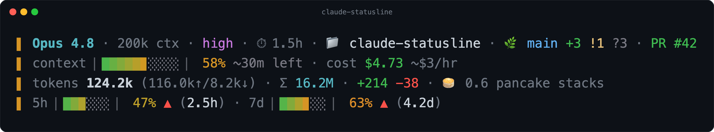
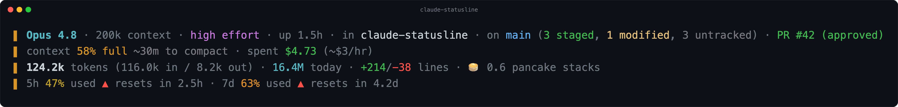
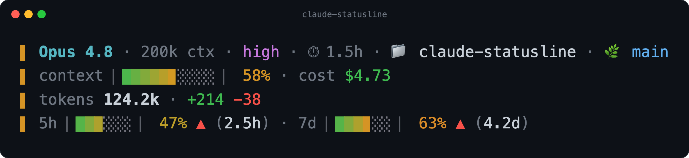

# claude-statusline

A frameless, information-dense status line for [Claude Code](https://claude.com/claude-code). One self-contained Python script, no dependencies, no Nerd Font required.



It reads Claude Code's session JSON on stdin and renders four fixed rows: who and where you are, how full and costly the session is, how much it has worked, and how close you are to your usage limits.

## What it shows

Reading the demo top to bottom:

- **Header:** model, context-window size, reasoning effort, session uptime, working folder, git branch with `+staged !modified ?untracked` and ahead/behind counts, and the current PR with its review state.
- **Context + cost:** a 24-bit gradient gauge of context-window usage that heats green to amber to red as it fills, a **runway** estimate (`~30m left`, projected from how fast context is growing), and running cost with burn rate.
- **Tokens:** total tokens this session with an input/output breakdown, a cross-session **daily total** (`Σ`), lines added/removed, and a whimsical cost-in-snacks "treat" that rerolls over time.
- **Limits:** gradient gauges for the 5-hour and 7-day rate limits, each with a ▲/→ trend arrow and a reset countdown. Labels turn bold red when a limit (or context) crosses its alert threshold.

Everything is colored by "heat": the left accent bar and the gauges shift from green to red as the thing they track fills up, so the whole line reddens as the session gets tighter.

## Design

- **Frameless.** A single colored accent bar (`▌`) per line instead of a box, metrics flowed with `·` separators. Dense without feeling like a wall.
- **No Nerd Font.** Pure Unicode box-drawing and standard emoji. Works in any terminal.
- **Cheap.** Pure Python, no `jq`/`awk`/`tail` subprocesses. Git runs once (cached 5s). Transcript token usage is summed incrementally from only the newly-appended bytes and cached.
- **Never corrupts the prompt.** Always renders exactly four rows and hard-truncates every line to the pane width, so it can't wrap and smear Claude Code's redraw over SSH/tmux.

## Presets

Not everyone wants the same density. Set `CCSTATUS_PRESET` (or `PRESET=` in the config file below) to one of three modes:

**`full`** (default) - the dense, symbol-forward dashboard above.

**`words`** - the same data spelled out in plain English, no gauges or glyphs to decode:



**`lean`** - just the core: context, cost, tokens, and limits. Nothing else competing for your eyes:



## Config file

Prefer a file to environment variables? Drop a `~/.claude/ccstatus.config` (override the path with `CCSTATUS_CONFIG`). One `KEY=VALUE` per line, `#` for comments. Keys are the `CCSTATUS_*` names without the prefix:

```ini
PRESET = words
BAR_W = 12
SHOW_TREAT = 0
```

Precedence is **preset < config file < environment variable**, so a `CCSTATUS_*` env var always wins for one-off overrides, and the file is your durable default. If the file does not exist, nothing changes.

## Install

Requires Python 3 (no packages). Git is optional (the git segment just disappears outside a repo).

1. Save `statusline.py` somewhere, e.g. `~/.claude/statusline.py`, and make it executable:

   ```sh
   chmod +x ~/.claude/statusline.py
   ```

2. Point Claude Code at it in `~/.claude/settings.json`:

   ```json
   {
     "statusLine": {
       "type": "command",
       "command": "~/.claude/statusline.py",
       "padding": 1,
       "refreshInterval": 10
     }
   }
   ```

That's it. Start (or `/resume`) a session and the line appears.

## Configuration

Tune behavior with `CCSTATUS_*` environment variables (set them in your shell profile). Defaults shown:

| Variable | Default | Meaning |
| --- | --- | --- |
| `CCSTATUS_PRESET` | `full` | Density mode: `full`, `words`, or `lean`. |
| `CCSTATUS_CONFIG` | `~/.claude/ccstatus.config` | Path to the optional config file. |
| `CCSTATUS_BAR_W` | `10` | Width of the context gauge, in cells. |
| `CCSTATUS_LIMIT_BAR_W` | `6` | Width of the 5h/7d gauges. |
| `CCSTATUS_CTX_ALERT` | `80` | Context % at which the label goes bold red with ⚠. |
| `CCSTATUS_ALERT_PCT` | `90` | Rate-limit % at which 5h/7d labels alert. |
| `CCSTATUS_SHOW_TREAT` | `1` | Show the cost-in-snacks treat (`0` to hide). |
| `CCSTATUS_TREAT_BUCKET` | `600` | Seconds of session time before the treat rerolls. |
| `CCSTATUS_SHOW_PR` | `1` | Show the PR badge (`0` to hide). |
| `CCSTATUS_LINKS` | `1` | Emit OSC-8 hyperlinks on branch/PR (`0` for plain text). |
| `CCSTATUS_TR_WINDOW` | `1800` | Trend/runway sampling window, in seconds. |
| `CCSTATUS_TR_SPACING` | `45` | Minimum seconds between trend samples. |
| `CCSTATUS_TR_MINHIST` | `150` | Minimum history before trend arrows / runway appear. |
| `CCSTATUS_TR_RATEMIN` | `1.0` | %/hour climb rate that flips a trend arrow to ▲. |
| `CCSTATUS_COLS` | auto | Force the render width (cells) when terminal detection fails. |
| `CCSTATUS_COLS_FALLBACK` | `80` | Width used only if detection fails entirely. |

If the line is wider than the pane, it progressively sheds the least essential detail (treat, then burn rate, breakdown, gauges, PR, git counts, daily total, cache, runway) until it fits, then truncates as a last resort. It never drops below four rows.

## Make it yours

This is a single readable script. Don't like the snack treat, the runway, or the emoji? Delete the bit you don't want. The layout is built from small `build_*` segment functions near the bottom, and the palette is one block of `rgb()` constants near the top.

## License

[MIT](LICENSE)
